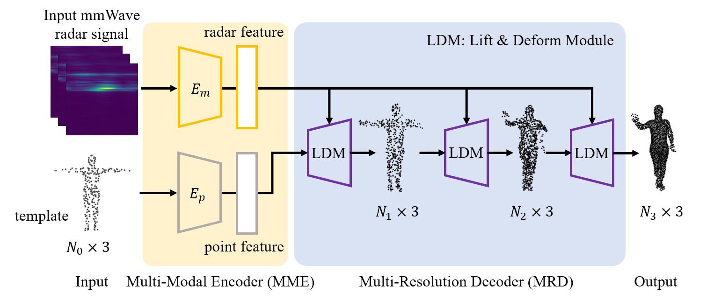

# mmPoint (BMVC2023)
## Introduction
This repository is the [mmPoint: Dense Human Point Cloud Generation from mmWave](https://papers.bmvc2023.org/0194.pdf) code implementation. In this paper, we propose to generate dense 3D human point clouds from mmWave radar signals.



## Dataset
- Step 1: Get the raw radar dataset
Go to [HuPR](https://github.com/robert80203/HuPR-A-Benchmark-for-Human-Pose-Estimation-Using-Millimeter-Wave-Radar) to get the raw radar dataset.

- Step 2: Get the pseudo 3D human point clouds generated in our paper.
Download the point clouds via this [Google Drive link](https://drive.google.com/file/d/19JDOpcPNShUUzIbZbfsseHp3GrW77B-n/view?usp=drive_link). The compressed file contains 34800 point cloud files (58 scenes, each of which has 600 frames point cloud). Each file has the fomatted name as "single\_\{SceneID\}_000\{FrameID\}.npy" (for instance, single\_2\_000100.npy). Each point cloud has 2048 points.

## Installation
Our code is implemented in Python 3.6, PyTorch 1.10.2, and CUDA 11.3.
- Install python Dependencies
```python
cd mmPoint
pip install -r requirements.txt
```

- Compile PyTorch 3rd-party modules.
```python
cd utils/ChamferDistancePytorch/chamfer3D
python setup.py install
cd -
cd utils/Pointnet2.PyTorch/pointnet2
python setup.py install
cd -
cd utils/emd
python setup.py install
cd -
```

## Preprocessing
Preprocess the raw radar data collected by the radar sensor (IWR1843Boost). 
- Step 1: Convert the raw .bin files into npy files
```
  cd tool
  python bin2npy.py
```

- Step 2: Convert the raw .npy files into hfd5 files that can be sent into the network directly
```
  python radarnpy2hdf5.py
```

## Train
- Before training, go to the cfg\\mmPoint.yaml file to do some configurations, such as setting the dataset path.
- To train the network, you can simply run:
```
  CUDA_VISIBLE_DEVICES=0 python train.py -c cfgs/mmPoint.yaml
```

## Prediction
You can simply run the following command to generate a prediction using your trained model:
```
  cd tools
  python predict.py
```
You can use 3D visualization software such as the [MeshLab](http://www.meshlab.net/) to open the predicted files in the 'results' folder to see the generated 3D human point cloud. 


## Citation
If our work is useful for your research, please consider citing:

```
@inproceedings{xie2023mmPoint,
	title={mmPoint: Dense Human Point Cloud Generation from mmWave},
	author={Qian, Xie and Qianyi, Deng and Ta-Ying, Cheng and Peijun, Zhao and Amir, Patel and Niki, Trigoni and Andrew, Markham},
	booktitle={The British Machine Vision Conference (BMVC)},
	year={2023}
}
```


## Acknowledgments
- This code largely benefits from excellent work-[HuPR](https://github.com/robert80203/HuPR-A-Benchmark-for-Human-Pose-Estimation-Using-Millimeter-Wave-Radar) repository, please also consider citing HuPR if you use this code.
- We include the following PyTorch 3rd-party libraries:  
[1] [ChamferDistancePytorch](https://github.com/ThibaultGROUEIX/ChamferDistancePytorch)  
[2] [emd](https://github.com/Colin97/MSN-Point-Cloud-Completion)  
[3] [Pointnet2.PyTorch](https://github.com/sshaoshuai/Pointnet2.PyTorch)  
